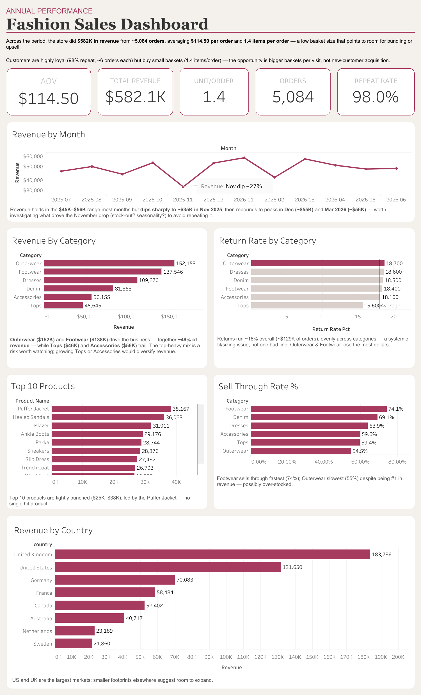

# 👗 Fashion Retail KPI Dashboard

**🔗 [Explore the interactive dashboard on Tableau Public]([PASTE_YOUR_TABLEAU_LINK](https://public.tableau.com/app/profile/seung.eun.yeo/viz/FirstFashionSalesDashboard/FashionSalesDashboard)**

***

## 📚 About Data

Twelve months of fashion retail transactions, **July 2025 – June 2026**: every line item, product, and customer behind $582,121 in net revenue.

| | | | |
| --- | --- | --- | --- |
| **$582,121** revenue | **5,084** orders | **7,009** units | **898** customers |
| **197** SKUs | **30** styles | **6** categories | **8** markets |

*[Note where the data came from — synthetic, generated, exported. Say it plainly.]*

#fashionanalytics

***

## 💡 Highlights

- **Revenue rank is a price ranking, not a demand ranking.** Every category moves 959–1,369 units, but revenue per unit spans $43 to $159. Outerwear leads on revenue while selling the *fewest* units of anything.
- **Half the business sits in two categories.** Outerwear and Footwear take 49.8% of revenue and nine of the top ten product slots — by opposite routes. Outerwear sells 163–223 units at $137–196 each; Footwear sells 260–325 at $95–111.
- **Baskets are thin.** 1.38 items per order against a $114.50 average order value. Most customers buy exactly one thing.
- **Margin is flat.** Every category converts revenue to gross margin at 52.7–55.1%, so profit follows revenue mix, not margin mix. There is no hidden high-margin category to lean into.
- **November 2025 collapsed to $35,261** — 27% below average and the only month under $40K. December brought no holiday spike either, which is unusual for fashion.
- **The UK is the largest market, not the US** ($183.7K vs $131.7K), and revenue per customer barely moves between countries ($610–681). Geographic growth is an acquisition problem.
- **One line item in five comes back.** Five of six categories fall within 0.6 points of each other (18.1–18.7%); only Tops is lower, at 15.6%.

***

## 🔧 Approach

Transaction-level data modeled, cleaned, and aggregated before visualization in **Tableau**.

- Returns held separately from revenue — excluded from every revenue metric, measured on their own for return rate
- Margin derived per line item rather than per category, so discounts and mixed baskets stay accounted for
- Sell-through measured per SKU, not per style name: 197 SKUs share only 30 style names, and rolling them up by name overstated rates by up to 6×
- Every headline figure reconciled against two independent breakdowns before publishing

📍 Clean data: [`/data`](data)
📍 Workbook: [`/tableau`](tableau)

***

## 📊 Visualization

*[Adjust to match what your dashboard actually contains.]*

**Scorecards** — revenue, orders, AOV, units per order, so the shape of the business is legible in three seconds.

**Revenue trend** — monthly line chart. November is the feature worth pointing at, not smoothing over.

**Category performance** — the view that surfaces the price-versus-demand distinction:

| category | revenue | units | rev/unit | margin % | return % |
| --- | --- | --- | --- | --- | --- |
| Outerwear | $152,153 | 959 | $158.66 | 53.9 | 18.7 |
| Footwear | $137,546 | 1,369 | $100.47 | 55.1 | 18.4 |
| Dresses | $109,270 | 1,297 | $84.25 | 54.1 | 18.6 |
| Denim | $81,353 | 1,080 | $75.33 | 52.9 | 18.5 |
| Accessories | $56,155 | 1,246 | $45.07 | 53.4 | 18.1 |
| Tops | $45,645 | 1,058 | $43.14 | 52.7 | 15.6 |

**Top products** — ranked by revenue, colored by category. Puffer Jacket leads at $38,167; the top ten sit in a tight $25K–38K band, so no single style is carrying the business.

**Geography** — revenue by country, customer count on hover. The UK and US together are 54% of revenue across eight markets.

**Filters** — *[which filters are wired up, and what they apply to]*

***

## ⚠️ Data Notes

Two figures need a caveat, and both are better stated here than discovered by a reader.

**The 98% repeat rate is real but not representative.** 880 of 898 customers ordered more than once, averaging 5.7 orders. Plausible arithmetic for 5,084 orders across 898 customers — but no real retailer sees it. The synthetic customer base is small and dense.

**Sell-through measures buy depth, not product appeal.** Every SKU sells roughly 35 units whether 40 or 200 were received, so sell-through is essentially 35 ÷ buy size. Aggregate is 34.7% (7,009 sold against 20,180 received), and seven SKUs exceed 100% — impossible, and confirmation that sales were generated independently of inventory. Reported on the dashboard, excluded from the recommendations below.

***

## ✅ Recommendations

**1. Test bundling against the 1.38-item basket.** Moving to 1.7 items per order lifts revenue without acquiring a single new customer — the largest untapped lever in the data.

**2. Diagnose November before planning next season.** A stock-out and a seasonal lull look identical on the trend line and call for opposite responses.

**3. Treat smaller markets as an acquisition problem.** A Swedish customer is worth about what a British one is; there just aren't many yet.

**4. Investigate the 18% return rate.** Uniform enough to be structural, which makes it a policy and fit question rather than a product-quality one — and at that scale it shapes net revenue more than any merchandising decision here.
